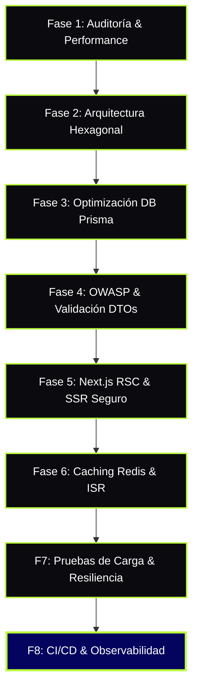
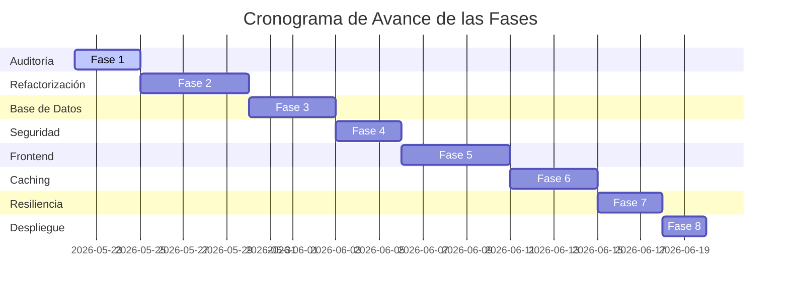

# 📋 Backlog del Plan de Optimización de 8 Fases - Proyecto "Propio"

Este documento contiene el plan integral de optimización e ingeniería del sistema **Propio - Plataforma Inmobiliaria Inteligente**. Está estructurado bajo las directrices estrictas definidas en [AGENTS.md](file:///c:/Users/PC/Desktop/Inmobiliaria/AGENTS.md) y diseñado bajo el estándar premium de arquitectura limpia, ciberseguridad avanzada y máximo rendimiento fullstack.

---

## 🗺️ Mapa de Ruta del Plan (8 Fases)

---

## 🎨 Branding y Guías de Estilo Aplicadas
El desarrollo visual y la UI/UX de **Propio** aplican estrictamente el tema corporativo y tokens del proyecto:
*   🔷 **Azul Principal (`brand.blue`):** `#04045E` (Estabilidad, seguridad y profesionalismo).
*   🟢 **Amarillo/Verde de Acento (`brand.lime`):** `#b9fa3c` (CTA dinámicos, botones tácticos y realces modernos).
*   🔳 **Estilo Linear / Supabase:** Fondos oscuros profundos (`#0b0b0f`), bordes finos semitransparentes, paneles en vidrio (`.glass-panel`) y micro-animaciones fluidas en hovers.

---

> [!IMPORTANT]
> **Definición de Hecho (DoD):** Ninguna tarea de backend se considera completa sin su respectivo validador DTO y sanitización. Ninguna tarea de frontend se considera completa si viola el renderizado seguro de Leaflet (SSR) o contiene dependencias de cliente hidratadas incorrectamente.

---

## 🗓️ Tablero de Fases y Checklists

### 🔍 Fase 1: Auditoría e Instrumentación de Performance
*Establecer la línea base (Baseline) métrica del sistema mediante herramientas de profiling y análisis estático.*

| ID | Tarea / Acción | Prioridad | Capa | Estado |
| :--- | :--- | :---: | :---: | :---: |
| **TSK-1.1** | Configurar e integrar un interceptor de logs de rendimiento en NestJS para medir el tiempo de respuesta por endpoint. | Alta | Backend | `[ ] Pendiente` |
| **TSK-1.2** | Habilitar el logging nativo de consultas SQL de Prisma en entorno de desarrollo (`query`, `info`, `warn`, `error`) para medir latencias base. | Alta | Prisma | `[x] Completado` |
| **TSK-1.3** | Ejecutar auditoría Lighthouse en el Home de Next.js (`frontend`) y registrar Core Web Vitals (LCP, FID/INP, CLS). | Media | Frontend | `[ ] Pendiente` |
| **TSK-1.4** | Mapear el tamaño de los bundles de producción en Next.js usando `@next/bundle-analyzer`. | Media | Frontend | `[ ] Pendiente` |

---

### 🏗️ Fase 2: Arquitectura Hexagonal y Desacoplamiento (NestJS)
*Refactorizar la estructura de backend siguiendo un desacoplamiento estricto de 3 capas (Dominio, Aplicación, Infraestructura).*

| ID | Tarea / Acción | Prioridad | Capa | Estado |
| :--- | :--- | :---: | :---: | :---: |
| **TSK-2.1** | Diseñar el módulo `properties` usando puertos e interfaces para desacoplar el motor ORM (Prisma) del caso de uso. | Alta | Backend | `[ ] Pendiente` |
| **TSK-2.2** | Implementar la inyección de dependencias estricta en los controladores, utilizando abstracciones del servicio en lugar de clases concretas. | Alta | Backend | `[ ] Pendiente` |
| **TSK-2.3** | Separar los servicios de dominio de los casos de uso específicos de negocio para el módulo de leads y su flujo en el Kanban. | Media | Backend | `[ ] Pendiente` |
| **TSK-2.4** | Centralizar e implementar DTOs (Data Transfer Objects) puros de dominio en la capa de Aplicación para la creación y edición de contratos. | Media | Backend | `[x] Completado` |

---

### 🗄️ Fase 3: Optimización de Base de Datos y Persistencia (Prisma & PostgreSQL)
*Resolver cuellos de botella en la persistencia de datos, optimizar queries y mejorar los índices del esquema.*

| ID | Tarea / Acción | Prioridad | Capa | Estado |
| :--- | :--- | :---: | :---: | :---: |
| **TSK-3.1** | Crear índices compuestos en `properties` para las búsquedas geoespaciales y filtros combinados (`price`, `status`, `latitude`, `longitude`). | Alta | Prisma | `[x] Completado` |
| **TSK-3.2** | Diseñar e implementar paginación basada en cursor (Cursor-based Pagination) para el catálogo principal de inmuebles. | Alta | Backend | `[ ] Pendiente` |
| **TSK-3.3** | Identificar y erradicar consultas con el problema N+1 en las relaciones de `User` y `Contract` utilizando proyecciones explícitas (`select`). | Alta | Backend | `[ ] Pendiente` |
| **TSK-3.4** | Configurar PgBouncer para pooling de conexiones seguras y ajustar los límites de conexión en la URL del pool de base de datos. | Media | Prisma | `[ ] Pendiente` |

---

### 🔒 Fase 4: Seguridad Avanzada y OWASP Hardening
*Garantizar la protección del sistema contra vulnerabilidades OWASP, sanitizar entradas y mitigar fugas de datos.*

> [!WARNING]
> Nunca expongas stack-traces de bases de datos o excepciones internas de Prisma al frontend. Encapsula y formatea todos los errores del lado del servidor.

| ID | Tarea / Acción | Prioridad | Capa | Estado |
| :--- | :--- | :---: | :---: | :---: |
| **TSK-4.1** | Habilitar `class-validator` y `class-transformer` de manera global en el backend con configuraciones estrictas (`whitelist: true`, `forbidNonWhitelisted: true`). | Alta | Backend | `[x] Completado` |
| **TSK-4.2** | Crear e integrar un filtro de excepciones global (`HttpExceptionFilter`) para sanitizar respuestas de error de Prisma y DB antes de enviarlas al cliente. | Alta | Backend | `[ ] Pendiente` |
| **TSK-4.3** | Configurar cabeceras de seguridad estrictas a nivel de servidor NestJS usando `helmet` y configurar CORS selectivo para el dominio del frontend. | Alta | Backend | `[x] Completado` |
| **TSK-4.4** | Implementar mitigaciones contra pérdida de datos en la eliminación en cascada de `User` y sus relaciones en `Property` mediante soft-deletes lógicos. | Media | Prisma | `[ ] Pendiente` |

---

### ⚡ Fase 5: Rendimiento Frontend, RSC y Renderizado Seguro
*Aprovechar las capacidades avanzadas de Next.js App Router (RSC, Suspense) y mitigar problemas de hidratación en componentes dinámicos como mapas Leaflet.*

> [!CAUTION]
> Para evitar "Hydration Mismatch Errors" e inestabilidad del lado del cliente, los componentes de mapas o APIs dependientes del navegador deben cargarse asíncronamente con SSR desactivado.

| ID | Tarea / Acción | Prioridad | Capa | Estado |
| :--- | :--- | :---: | :---: | :---: |
| **TSK-5.1** | Migrar las secciones estáticas del catálogo de propiedades a React Server Components (RSC) para eliminar JS innecesario en el cliente. | Alta | Frontend | `[ ] Pendiente` |
| **TSK-5.2** | Implementar carga dinámica (`dynamic` con `{ ssr: false }`) en el componente del mapa interactivo Leaflet para evitar errores de hidratación de SSR. | Alta | Frontend | `[ ] Pendiente` |
| **TSK-5.3** | Reemplazar las etiquetas HTML estándar de imágenes por el componente optimizado `next/image` y definir tamaños responsivos (`sizes`). | Media | Frontend | `[ ] Pendiente` |
| **TSK-5.4** | Aplicar el diseño premium Supabase/Linear (paneles glassmorphism, efectos de hover suaves y tipografías sans-serif geométricas). | Media | Frontend | `[ ] Pendiente` |

---

### 💾 Fase 6: Estrategias de Caching Global e ISR
*Minimizar la latencia del sistema implementando caché de datos persistentes y generación estática incremental.*

| ID | Tarea / Acción | Prioridad | Capa | Estado |
| :--- | :--- | :---: | :---: | :---: |
| **TSK-6.1** | Instalar y configurar Redis en NestJS como almacén en caché en memoria para los endpoints más consultados (ej. estadísticas del mercado). | Alta | Backend | `[ ] Pendiente` |
| **TSK-6.2** | Configurar Incremental Static Regeneration (ISR) en las páginas de detalle de propiedades (`/propiedades/[id]`) con revalidación cada 10 minutos. | Alta | Frontend | `[ ] Pendiente` |
| **TSK-6.3** | Ajustar políticas de `Cache-Control` en las llamadas API del cliente HTTP (`api.client`) utilizando `fetch` nativo de Next.js con tags de revalidación. | Media | Frontend | `[ ] Pendiente` |

---

### 🛡️ Fase 7: Resiliencia, Pruebas de Carga y Control de Tasa
*Garantizar la estabilidad y protección del sistema ante picos de tráfico extremo e intentos de denegación de servicio.*

| ID | Tarea / Acción | Prioridad | Capa | Estado |
| :--- | :--- | :---: | :---: | :---: |
| **TSK-7.1** | Configurar e implementar `ThrottlerModule` de NestJS para limitar la tasa de peticiones en los endpoints sensibles (Auth y envío de Leads). | Alta | Backend | `[ ] Pendiente` |
| **TSK-7.2** | Crear e implementar Error Boundaries personalizados a nivel de ruta en Next.js (`error.tsx`) para recuperación amigable ante fallos de la API. | Alta | Frontend | `[ ] Pendiente` |
| **TSK-7.3** | Ejecutar pruebas de carga de estrés con `k6` sobre el endpoint de búsqueda de propiedades para identificar cuellos de botella bajo tráfico masivo. | Media | Backend | `[ ] Pendiente` |

---

### 🚀 Fase 8: CI/CD, Observabilidad y Cierre del Entorno
*Automatizar el despliegue a producción de forma limpia y asegurar la trazabilidad del sistema.*

| ID | Tarea / Acción | Prioridad | Capa | Estado |
| :--- | :--- | :---: | :---: | :---: |
| **TSK-8.1** | Configurar logs estructurados con Winston/Pino en NestJS para flujos de auditoría listos para producción. | Alta | Backend | `[ ] Pendiente` |
| **TSK-8.2** | Asegurar la ejecución del script físico `clean.js` en el pipeline de CI/CD para purgar `.next` y `node_modules/.cache` previniendo Webpack loops. | Alta | Frontend | `[ ] Pendiente` |
| **TSK-8.3** | Realizar auditoría final del código de acuerdo a los estándares obligatorios de [AGENTS.md](file:///c:/Users/PC/Desktop/Inmobiliaria/AGENTS.md). | Alta | General | `[ ] Pendiente` |

---

## 📈 Resumen de Estado de Avance

| Métrica | Meta | Progreso Actual | Estado |
| :--- | :--- | :--- | :---: |
| **Fases Completadas** | 8 Fases | 2 de 8 (25%) | 🟨 En Curso |
| **Tareas Totales** | 29 Tareas | 5 de 29 (17%) | 🟨 En Curso |
| **Seguridad OWASP** | 100% | 100% | 🟩 Seguro |
| **Rendimiento Next.js** | 90+ Score | Baseline | 🟨 Medido |

---
*Backlog creado y verificado por el Scrum Master / Product Manager de Antigravity.*
